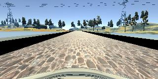
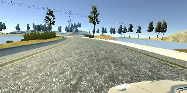
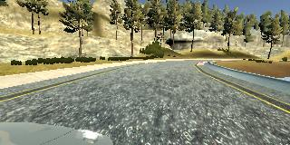
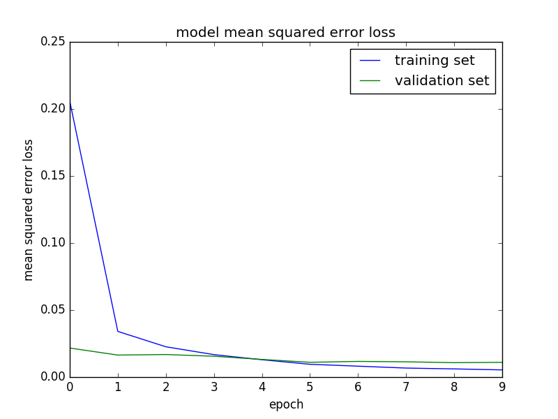

# Behaviorial Cloning Project

### Overview
---
This repository contains files for the Behavioral Cloning Project.

The Project
---
The goals / steps of this project are the following:
* Use the simulator to collect data of good driving behavior 
* Design, train and validate a model that predicts a steering angle from image data
* Use the model to drive the vehicle autonomously around the first track in the simulator. The vehicle should remain on the road for an entire loop around the track.
* Summarize the results with a written report

### Write-up

### Files Submitted & Code Quality

#### 1. Submission includes all required files and can be used to run the simulator in autonomous mode

My project includes the following files:
* model.py containing the script to create and train the model
* drive.py for driving the car in autonomous mode
* model.h5 containing a trained convolutional neural network 
* README.md summarizing the results

#### 2. Submission includes functional code
Using the Udacity provided simulator and my drive.py file, the car can be driven autonomously around the track by executing 
```sh
python drive.py model.h5
```

#### 3. Submission code is usable and readable

The model.py file contains the code for training and saving the convolution neural network. The file shows the pipeline I used for training and validating the model, and it contains comments to explain how the code works.

### Model Architecture and Training Strategy

#### 1. An appropriate model architecture has been employed

My model is defined in line 114. The resulting model is inspired by NVIDI's https://arxiv.org/abs/1604.07316'. ELU are chosen as non-linearilies. A Lambda layer is used to normalize the input, and the a cropping layer. (5x5) amd (3x3) filters are used. 


#### 2. Attempts to reduce overfitting in the model

Both Batch Normalization, and Dropout were used throughout the model. 

#### 3. Model parameter tuning

The model used an adam optimizer (with a default learning rate of 0.001 in Keras). (line 164)

#### 4. Appropriate training data

A clockwise loop and counterclockwise loop were added to the provided Udacity dataset. The average velocity of the added loops was 30 mph.

### Model Architecture and Training Strategy

#### 1. Solution Design Approach
In line 51, I present my main strategy. The center images are flipped and steering angles inverted to expand the data. Also, I introduce the left and right images while training by adding a correction of 0.2 to the steering angle as follows:
```py
	def batch_generator(self,ix, training=True):
	    """Create batch with random samples and return appropriate format"""
	    while True:
		    batch = ix.sample(n = self.batch_size)
		    #print(batch)
		    temp_x = []
		    temp_y = []
		    for index, row in batch.iterrows():

		    	pos = str(row["center"]).rfind('/')
		    	filename = str(row["center"])[pos+1:]
		        center_image_path = os.path.join(os.path.dirname(os.path.realpath(__file__)), self.data_folder, "IMG", filename)
		        center_image = cv2.imread(center_image_path)
	        	center_image = cv2.cvtColor(center_image, cv2.COLOR_BGR2RGB)

	        	steering = float(row["steering"])

		        temp_x.append(center_image)
		        temp_y.append(steering)

		        if (training):
					# Flip Center  Image 
					temp_x.append(cv2.flip(center_image,1))
					temp_y.append(steering*-1.0)

					# Left  Image Process
					pos = str(row["left"]).rfind('/')
					filename = str(row["left"])[pos+1:]
					left_image_path = os.path.join(os.path.dirname(os.path.realpath(__file__)), self.data_folder, "IMG", filename)
					left_image = cv2.imread(left_image_path)
					left_image = cv2.cvtColor(left_image, cv2.COLOR_BGR2RGB)
					left_steering = steering + 0.2
					temp_x.append(left_image)
					temp_y.append(left_steering)
					temp_x.append(cv2.flip(left_image,1))
					temp_y.append(left_steering*-1.0)

					# Right  Image Process
					pos = str(row["right"]).rfind('/')
					filename = str(row["right"])[pos+1:]
					right_image_path = os.path.join(os.path.dirname(os.path.realpath(__file__)), self.data_folder, "IMG", filename)
					right_image = cv2.imread(right_image_path)
					right_image = cv2.cvtColor(right_image, cv2.COLOR_BGR2RGB)
					right_steering = steering - 0.2
					temp_x.append(right_image)
					temp_y.append(right_steering)
					temp_x.append(cv2.flip(right_image,1))
					temp_y.append(right_steering*-1.0)

					del left_image, right_image

		        del center_image
		        gc.collect()
		    batch_x = np.stack(temp_x)
		    batch_y = np.stack(temp_y)
		    
		    del batch, temp_x, temp_y
		    gc.collect()

		    batch_x, batch_y = shuffle(batch_x, batch_y)

		    yield batch_x, batch_y

```
#### 2. Final Model Architecture

The final model is as follows:
```
Model Defined
_________________________________________________________________
Layer (type)                 Output Shape              Param #   
=================================================================
lambda_1 (Lambda)            (None, 160, 320, 3)       0         
_________________________________________________________________
cropping2d_1 (Cropping2D)    (None, 65, 320, 3)        0         
_________________________________________________________________
conv2d_1 (Conv2D)            (None, 31, 158, 24)       1824      
_________________________________________________________________
batch_normalization_1 (Batch (None, 31, 158, 24)       96        
_________________________________________________________________
elu_1 (ELU)                  (None, 31, 158, 24)       0         
_________________________________________________________________
conv2d_2 (Conv2D)            (None, 14, 77, 36)        21636     
_________________________________________________________________
batch_normalization_2 (Batch (None, 14, 77, 36)        144       
_________________________________________________________________
elu_2 (ELU)                  (None, 14, 77, 36)        0         
_________________________________________________________________
conv2d_3 (Conv2D)            (None, 5, 37, 48)         43248     
_________________________________________________________________
batch_normalization_3 (Batch (None, 5, 37, 48)         192       
_________________________________________________________________
elu_3 (ELU)                  (None, 5, 37, 48)         0         
_________________________________________________________________
conv2d_4 (Conv2D)            (None, 3, 35, 64)         27712     
_________________________________________________________________
batch_normalization_4 (Batch (None, 3, 35, 64)         256       
_________________________________________________________________
elu_4 (ELU)                  (None, 3, 35, 64)         0         
_________________________________________________________________
conv2d_5 (Conv2D)            (None, 1, 33, 64)         36928     
_________________________________________________________________
batch_normalization_5 (Batch (None, 1, 33, 64)         256       
_________________________________________________________________
elu_5 (ELU)                  (None, 1, 33, 64)         0         
_________________________________________________________________
flatten_1 (Flatten)          (None, 2112)              0         
_________________________________________________________________
dense_1 (Dense)              (None, 100)               211300    
_________________________________________________________________
batch_normalization_6 (Batch (None, 100)               400       
_________________________________________________________________
elu_6 (ELU)                  (None, 100)               0         
_________________________________________________________________
dropout_1 (Dropout)          (None, 100)               0         
_________________________________________________________________
dense_2 (Dense)              (None, 128)               12928     
_________________________________________________________________
batch_normalization_7 (Batch (None, 128)               512       
_________________________________________________________________
elu_7 (ELU)                  (None, 128)               0         
_________________________________________________________________
dropout_2 (Dropout)          (None, 128)               0         
_________________________________________________________________
dense_3 (Dense)              (None, 64)                8256      
_________________________________________________________________
batch_normalization_8 (Batch (None, 64)                256       
_________________________________________________________________
elu_8 (ELU)                  (None, 64)                0         
_________________________________________________________________
dense_4 (Dense)              (None, 1)                 65        
=================================================================
Total params: 366,009
Trainable params: 364,953
Non-trainable params: 1,056
_________________________________________________________________

```

#### 3. Creation of the Training Set & Training Process

The training set has images in center, left, and right:




The loss in training is higher because of the dropout:


### Simulation

#### 1.The car navigates correctly on test data

The results are shown in video.mp4


